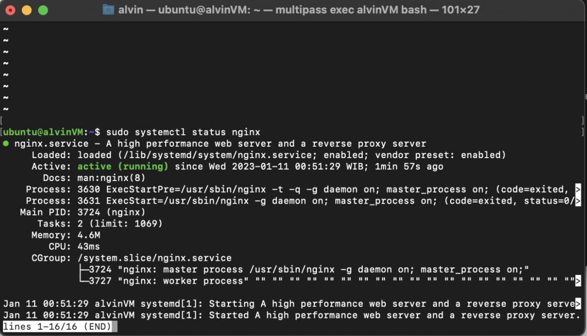
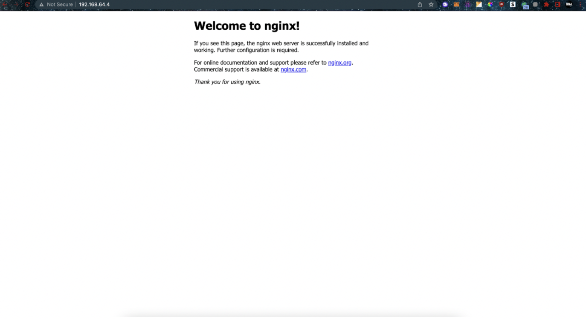

**Linux Shell & Computer Networking**

1. **Perbedaan antara IP Private & IP Public**
    1. **IP Public**

        **IP Public adalah sebuah alamat internet yang bisa digunakan oleh   semua orang di dunia untuk mengakses suatu komputer atau perangkat yang terhubung ke internet, ip public dapat didapat dari penyedia internet dan dapat digunakan untuk membuat server atau hosting website.**

    2. **IP Private**

        **IP Privat hanya bisa digunakan dalam jaringan pribadi dan tidak bisa diakses dari luar jaringan tersebut. **

**	**

2. **Jelaskan perbedaan Client-to-server & Peer-to-peer**
    3. **Client-to-server**

        **Client-to-server adalah jaringan komputer ke server dengan perantara internet sebagai jembatan yang harus dilalui.**

    4. **Peer-to-peer**

        **Peer-to-peer adalah jaringan langsung antara dua komputer atau lebih tanpa perantara.**

3. **Jalankan Nginx diserver**

4. **Command Shell**

    vi, untuk text editor selain nano

    cut, untuk menghapus bagian spesifik dari isi file

	tail, untuk membuka isi file selain cat (tetapi hanya menampilkan 10 line terakhir)
