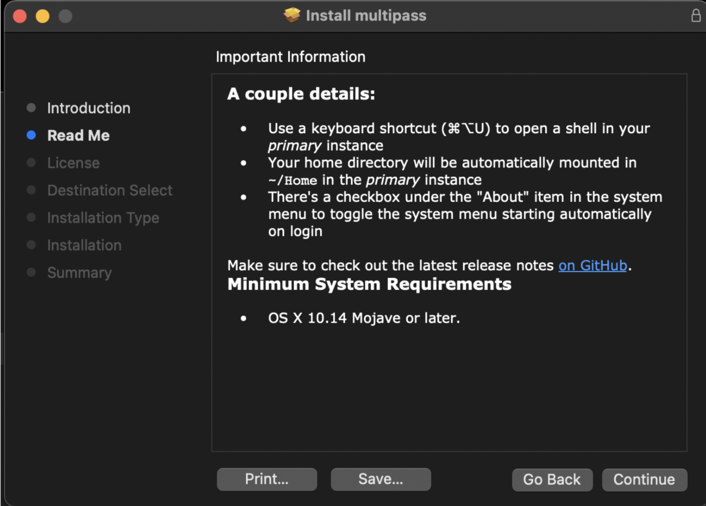
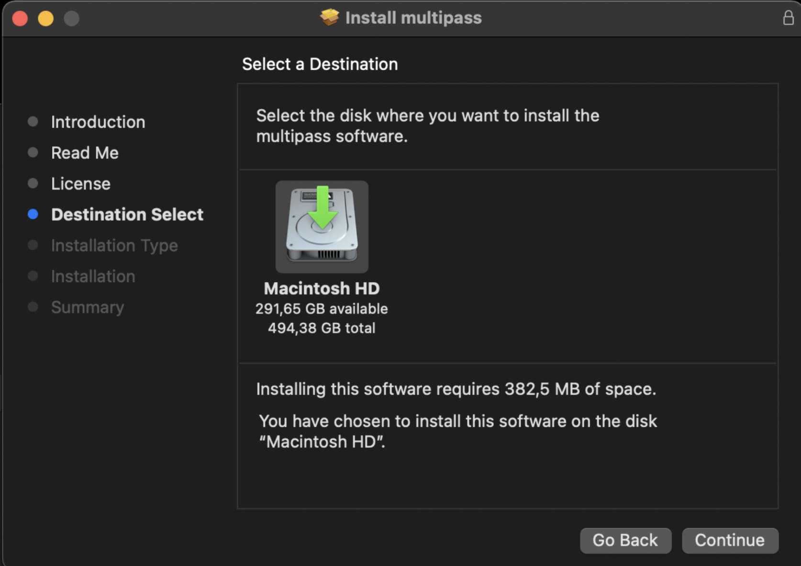

**INTRODUCTION TO DEVOPS**

1. **Definisi DevOps**

    **Devops** adalah sebuah kultur dimana tim pengembang(development) dan tim operasi(operations) berkolaborasi dalam pengembangan aplikasi, yang membuat pengembangan aplikasi menjadi lebih cepat dan efisien.

2. **Lifecycle DevOps**

1. **Plan**

    Pada tahap Plan, seluruh perencanaan dan perancangan untuk pengembangan aplikasi akan dilakukan. Biasanya, tahap ini akan dipimpin oleh seorang Project Manager. Aturan, persyaratan, dan feedback dari stakeholders dan user akan dikumpulkan untuk membuat roadmap project. Tools yang umum digunakan untuk melakukan tracking diantaranya adalah Jira, ClickUp, dan lainnya.

2. **Code**

    Pada tahap ini, developer akan mulai menuliskan kode untuk aplikasi yang akan dibuat. Setelah selesai menulis kode, developer kemudian akan menyimpan kode tersebut ke repository github menggunakan proses push.

3. **Build**

    Setelah kode dipush ke repository, tahap selanjutnya adalah build. Build merupakan proses mengubah kode yang ditulis oleh developer menjadi sebuah aplikasi yang siap dijalankan. Sebelum melakukan build, developer lain biasanya akan melakukan diskusi untuk memberikan feedback dan review terhadap kode yang telah ditulis. Setelah selesai diskusi, build aplikasi akan dilakukan menggunakan alat yang sesuai dengan jenis aplikasi yang akan dibuat. Contohnya, jika ingin menjadikan aplikasi sebagai image dapat menggunakan Docker.

4. **Test**

    Setelah build aplikasi selesai, tahap selanjutnya adalah melakukan pengujian. Pengujian ini bertujuan untuk mengetahui apakah aplikasi yang dibuat memenuhi kriteria yang ditetapkan, berfungsi dengan baik, dan sesuai dengan desain yang diinginkan. Jika terdapat kekurangan atau masalah, proses akan berhenti pada tahap ini dan perbaikan akan dilakukan. Namun jika aplikasi sudah sesuai dengan kriteria yang ditetapkan, maka lanjut ke tahap release.

5. **Release**

    Pada tahap Release, aplikasi yang sudah lulus pengujian akan diberi label atau nomor versi. Setelah itu, aplikasi tersebut akan di-deploy.

6. **Deploy**

    Deploy adalah proses menempatkan atau menyebarkan aplikasi yang dibuat, sehingga dapat diakses oleh user. Alat yang sering digunakan untuk proses ini adalah AWS, CodeDeploy dan Jenkins.

7. **Operate**

    Pada tahap Operate, tim Operation akan memastikan bahwa aplikasi dan infrastruktur berjalan dengan baik. Data performance, error, dan lainnya juga akan dilihat. Jika terdapat kesalahan atau bug, user dapat memberikan feedback yang kemudian akan menjadi bahan pertimbangan untuk pengembangan aplikasi selanjutnya.

8. **Monitor**

    Tahap Monitor merupakan tahap terakhir dari DevOps Lifecycle. Pada tahap ini, tim akan mengumpulkan semua data performance, error, dan feedback yang telah dikumpulkan sebelumnya. Kemudian, data tersebut akan digunakan untuk melakukan evaluasi atau introspeksi terhadap aplikasi yang dikembangkan. Selain itu, tim juga akan memantau pipeline yang dibuat untuk menghindari adanya bottlenecks yang dapat menghambat produktivitas pengembangan aplikasi di masa yang akan datang.

3. **Instalasi Ubuntu Server**
* Pertama-tama tahap yang harus dilakukan adalah mendownload vm dan ubuntu live server, disini saya menggunakan vm multipass, kalian bisa mendownload dilink dibawah ini :

    Ubuntu Live Server : [https://ubuntu.com/download/server#downloads](https://ubuntu.com/download/server#downloads)

    Multipass : [https://multipass.run/install](https://multipass.run/install)

    Setelah proses download keduanya selesai sekarang saatnya untuk install VM kita

* Installation VM

    Klik langsung `Continue`

    Selanjutnya `Continue`

    Klik Continue dan Agree saja termsnya

    Disini kalian pilih hdd yang akan diinstall VMnya, jika sudah dipilih langsung saja klik `continue`

    Disini kalian akan memilih install location vm multipass, jika sudah klik `install`

    Jika berhasil terinstall maka akan muncul instalasi sukses

    Selanjutnya kita masuk ketahap config IP static

* Setup multipass dan setting ip statis

    Pertama kita akan membuat vm kita dengan command seperti dibawah.

    Setelah kita berhasil membuat vm selanjutnya kita cek apakah vm kita sudah running.

Selanjutnya kita akan masuk kedalam vm yang telah kita buat 

    Setelah masuk kita pastikan ip address vm kita, dan kita save ip vm kita

    Lalu kita masuk ke folder /etc/netplan

    Command ls untuk melihat isi file yang ada pada folder /netplan

    Lalu kita buka dengan command `sudo nano 50-cloud-init.yaml`

    Setelah terbuka bisa kita lihat kalau setting ip vm kita dhcp, selanjutnya kita akan edit agar ipnya tidak dapat berubah-ubah.

    Kalian bisa mengikuti setup dibawah ini

    Setelah kalian save file .yaml tersebut selanjutnya kita akan apply perubahan ipconfig yang telah kita lakukan dengan command `sudo netplan apply`

    Step terakhir adalah mengetes apakah vm kita sudah terhubung dengan google.

    Dan servernya juga sudah terhubung dengan local network kita.

