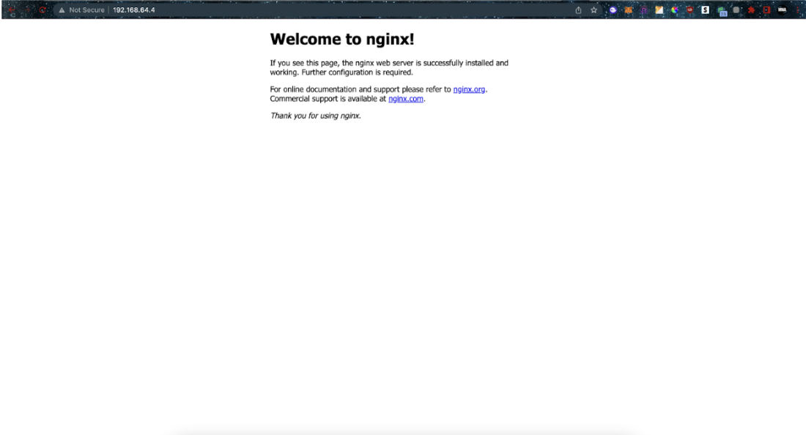
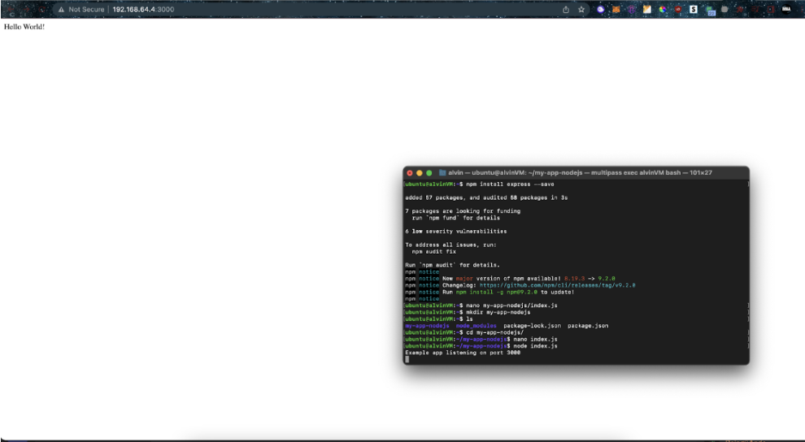
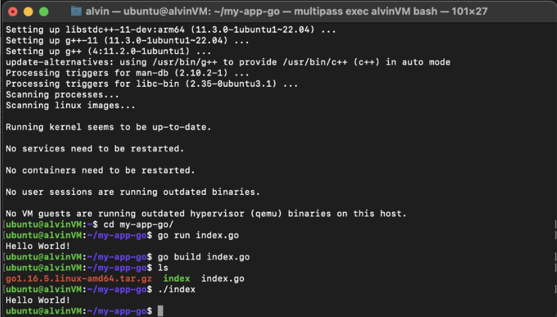
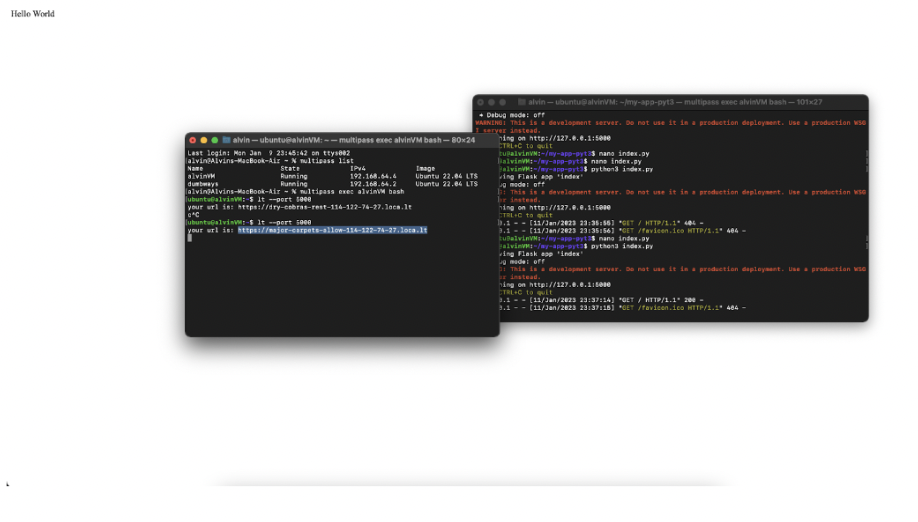
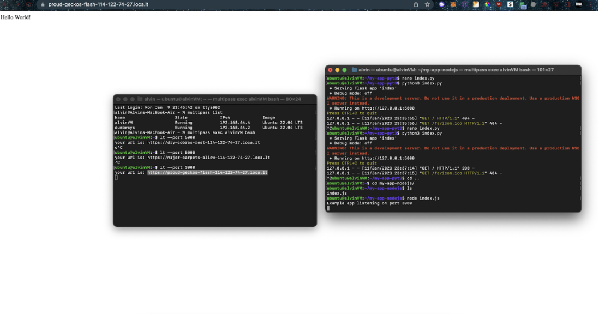
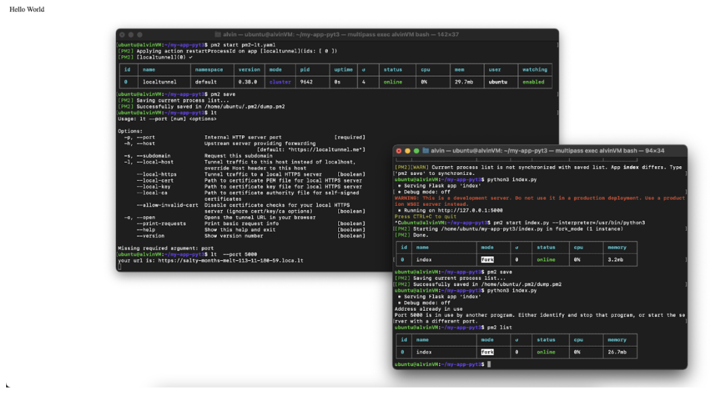

**APPLICATION SERVER**

1. Menjalankan aplikasi Webserver (nginx/apache2)

2. Menjalankan 3 aplikasi "hello world" menggunakan nodejs, golang dan python
* NodeJS

* Golang

* Python

3. Gunakan localtunnel untuk menjalankan "Hello world!" nodejs

    Challenge

    Jalankan "Hello world" di python3 melalui port 5000 (gunakan flask), lalu akses dengan localtunnel

    Gunakan PM2

