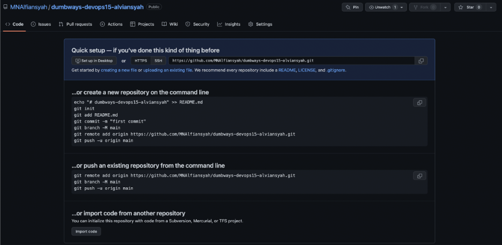
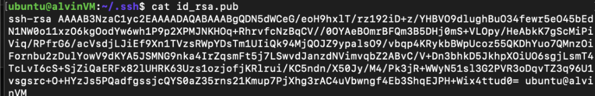
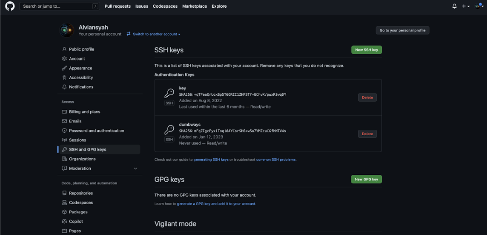
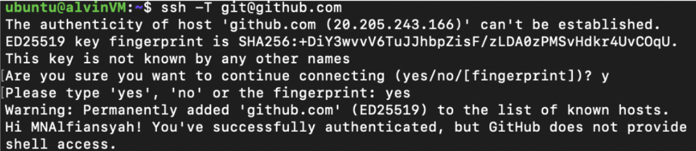
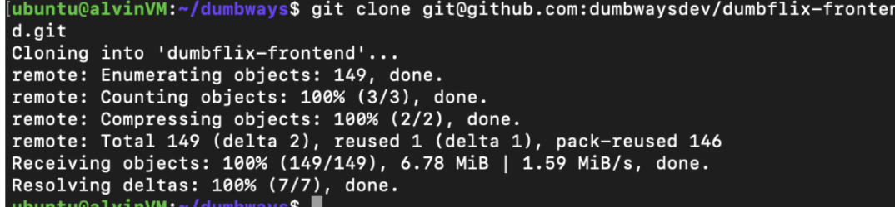
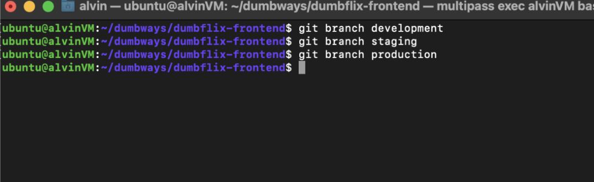

**Version Control System w/ Git**

1. jelaskan definisi distributed revision control!

    Metode kolaborasi antar dev untuk mengatur dan mengelola perubahan pada kode dimana setiap orang dapat memiliki salinan lengkap dari repositori dan melakukan perubahan tanpa harus melalui server.

2. Buat repository untuk tugas kalian di github Format : dumbways-devops15-&lt;nama kalian>

3. Hubungkan ssh public key ke akun github

4. Clone repository dumbflix-frontend & buat 3 branch (Development, Staging & Production)

