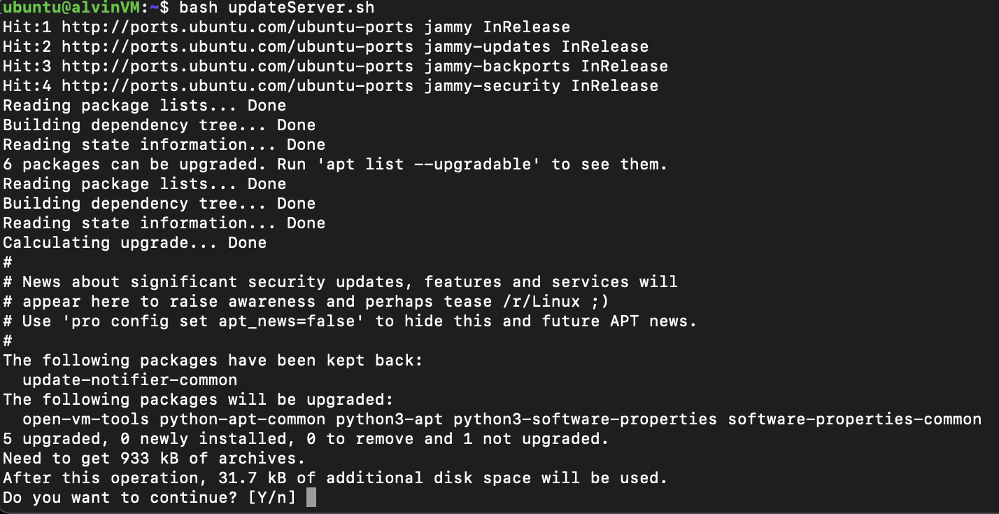
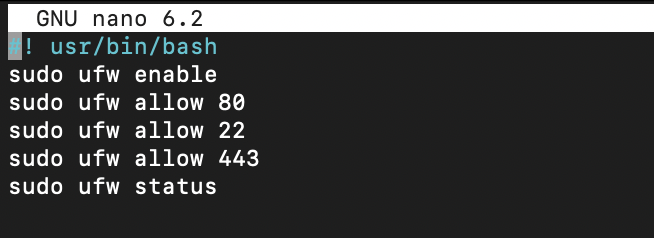
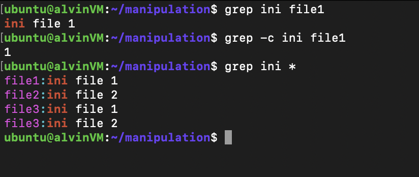

**Manage Server With Terminal**

**1. Apa itu terminal**

**	**Terminal adalah command prompt atau shell untuk melakukan instruksi pada system, contohnya membuat file, menghapus file, mengedit file, memberi akses pada folder dan lainnya.

**2. BASH script untuk update dan upgrade server, lalu install nginx/apache2 (salah satu)**

**3. BASH script untuk memberi akses ke port 22,80,443**

**4. Tugas text manipulation**

**    - contoh penggunaan cat, grep, echo & sort**

**    - mengganti text 'Dumbways' ke 'Bootcamp'**

**5. Gunakan nmon untuk tampilkan CPU usage, RAM usage, Disk dan Resources OS & Proc**

