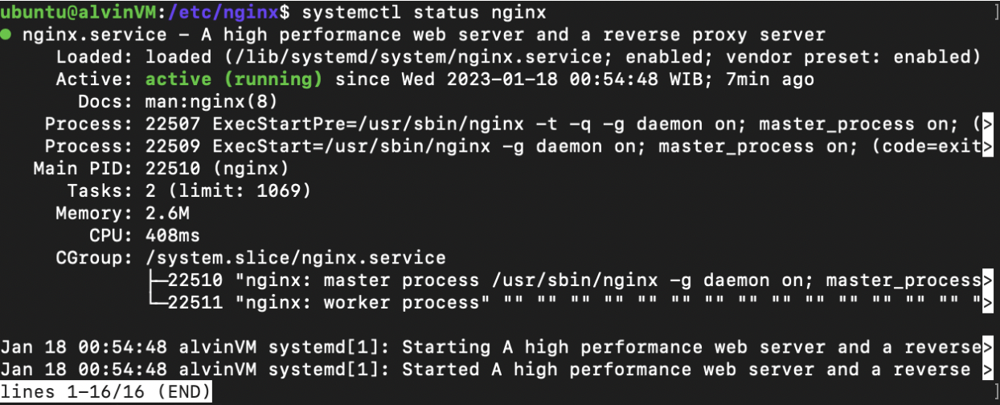
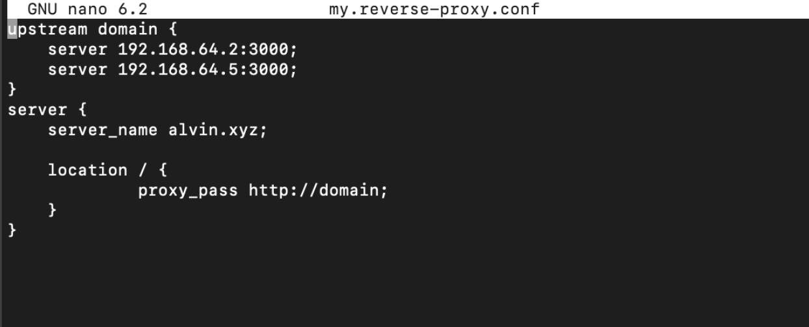
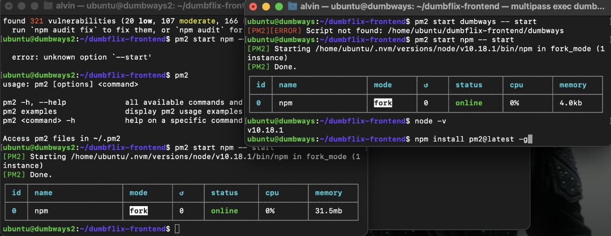
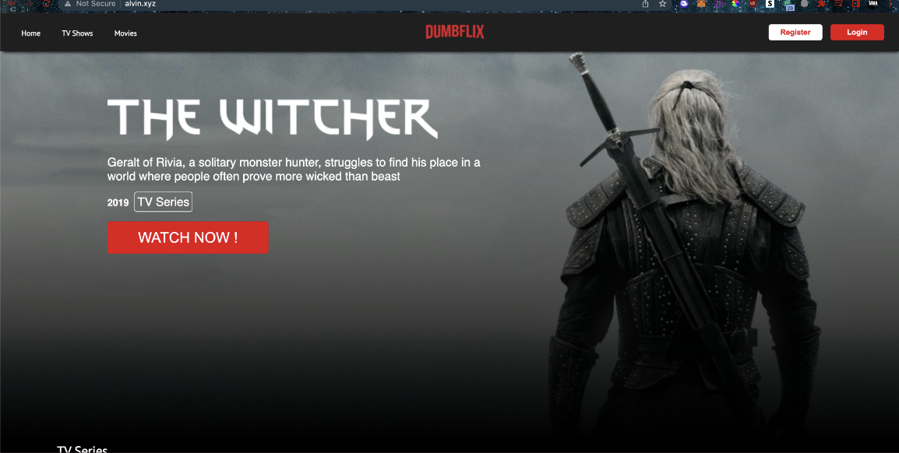

**Web Server & Load Balancing**

**1. Definisi Web Server**

**	**Web Server adalah layanan yang menyediakan data untuk mengakses http/https. 

**2. Jalankan 2 VM (Optional)**

**  - VM 1 = appserver**

**  - VM 2 = nginx**

**3. VM1 :**

**  - jalankan aplikasi dumbflix-frontend**

**  - gunakan PM2 (_Challenge_)**

**4. VM2 :**

**  - jalankan nginx **

**  - buat konfigurasi reverse proxy dengan domain (gunakan nama kalian) mengarah ke app di VM1**

**  - buat konfigurasi load balance antara VM1 dan VM2**

**5. Domain bisa diakses melalui web browser kalian (edit filenya di /etc/hosts)**

